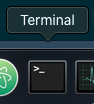
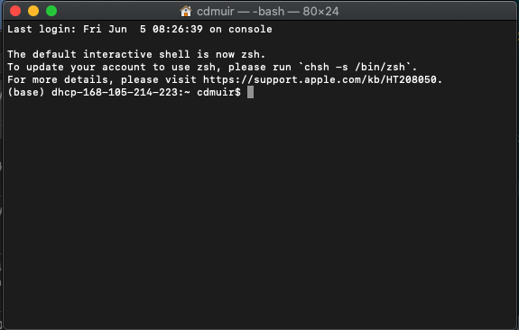

```{r setup, include=FALSE}
knitr::opts_chunk$set(echo = TRUE)
```

Material adopted from https://thecoatlessprofessor.com/programming/cpp/r-compiler-tools-for-rcpp-on-macos/

### Xcode command line tools

1. Open a shell using the `Terminal` app  from the Dock or from `/Applications/Utilities/`. It should look something like this when you open it:



2. Install Xcode CLI toolchain by typing the following command into `Terminal`

`xcode-select --install`

3. Press "Install" and accept terms.

4. Verify installation by typing into `Terminal`:

`gcc --version`

It should tell you clang version `11.X.X` has been installed.

### Install gfortran binary

1. Download link: https://github.com/fxcoudert/gfortran-for-macOS/releases/download/8.2/gfortran-8.2-Mojave.dmg

2. Install like normal `.dmg` by following prompts.

The installer will place the `gfortran` binary into `/usr/local/gfortran`. This will be picked up by the default implicit variable set by `R` during compilation.

### Install *R* 4.0.0

1. Download the software from this link: https://cran.r-project.org/bin/macosx/R-4.0.0.pkg

2. Follow prompts to install.

### Install *RStudio* 1.3.X

1. Download the software from this link: https://download1.rstudio.org/desktop/macos/RStudio-1.3.959.dmg

2. Follow prompts to install.

### Install **muirpkgs**

This [package](https://github.com/muir-lab/muirpkgs) will install commonly used *R* packages.

1. Open *RStudio*

2. In the `Console`, install the **remotes** package:

`install.packages("remotes")`

3. Install **muirpkgs**:

`remotes::install_github("muir-lab/muirpkgs")`


