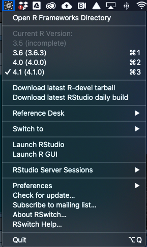

```{r setup, include=FALSE}
knitr::opts_chunk$set(echo = TRUE)
```

Material adopted from https://thecoatlessprofessor.com/programming/cpp/r-compiler-tools-for-rcpp-on-macos/

### Xcode command line tools

1. Open a shell using the `Terminal` app  from the Dock or from `/Applications/Utilities/`. It should look something like this when you open it:


2. Install Xcode CLI toolchain by typing the following command into `Terminal`

`xcode-select --install`

3. Press "Install" and accept terms.

4. Verify installation by typing into `Terminal`:

`gcc --version`

It should tell you clang version `11.X.X` has been installed.

### Install gfortran binary

1. Download link: https://github.com/fxcoudert/gfortran-for-macOS/releases/download/8.2/gfortran-8.2-Mojave.dmg

2. Install like normal `.dmg` by following prompts.

The installer will place the `gfortran` binary into `/usr/local/gfortran`. This will be picked up by the default implicit variable set by `R` during compilation.

### Install *R* 4.1.0 (latest release)

1. Download the software from this link: https://cran.r-project.org/bin/macosx/base/R-4.1.0.pkg

2. Follow prompts to install.

### Install *R*-devel (development version)

1. Download the tarball (`R-devel.tar.gz`) from this site (http://mac.r-project.org/) and save it to your Desktop.

2. Open `Terminal` and `cd` to your root directory like this:

`cd /`

3. Install using the command below. This is for the computer with userid `muirlab`. You would have to change the userid on another computer.

`tar -xvzf Users/muirlab/Desktop/R-devel.tar.gz`

### Install *RStudio* 1.4.X

1. Download the software from this link: https://download1.rstudio.org/desktop/macos/RStudio-1.4.1717.dmg

2. Follow prompts to install.

### Install RSwitch v1.7.0

1. Download RSwitch v1.7.0 from https://rud.is/rswitch/

2. Double-click to unzip.

3. Move `RSwitch` app to `Applications` folder.

4. Double-click to open. You should see the RSwitch logo appear in the upper-right menu bar. If you have successfully installed *R* 4.1.0 (latest release) and 4.X.X (devel), then you should see something like this when you click on the RSwitch icon:


Most of the time, you will be working with the latest release, but for test new packages, we also need the devel version.

### Install **muirpkgs** in *R* 4.1.0

This [package](https://github.com/muir-lab/muirpkgs) will install commonly used *R* packages. Note that you will have to install packages in *both* the release and devel versions of *R*.

1. In RSwitch, select `4.1 (4.1.0)`, then launch *RStudio*

2. In the `Console`, install the **remotes** package:

`install.packages("remotes")`

3. Install **muirpkgs**:

`remotes::install_github("muir-lab/muirpkgs")`

### Clone lab manuals

1. Open `Terminal` navigate to `Documents`. This should work:

`cd ~/Documents`

2. Clone the `manuals` repo

`git clone https://github.com/muir-lab/manuals.git`

### Create local directory for *R* software packages

1. Open `Terminal` navigate to `Documents`. This should work:

`cd ~/Documents`

2. Execute the following commands to make empty directories that software packages will go into and clone repors:

`mkdir software`
`cd software`

`mkdir licorer`
`git clone https://github.com/cdmuir/licorer.git`
`cd ..`

`mkdir photosynthesis`
`git clone https://github.com/cdmuir/photosynthesis.git`
`cd ..`

`mkdir tealeaves`
`git clone https://github.com/cdmuir/tealeaves.git`
`cd ..`
