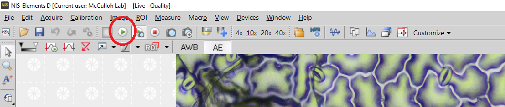
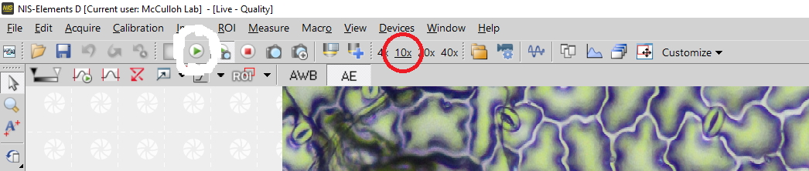
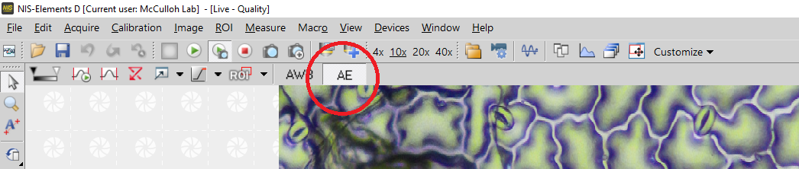
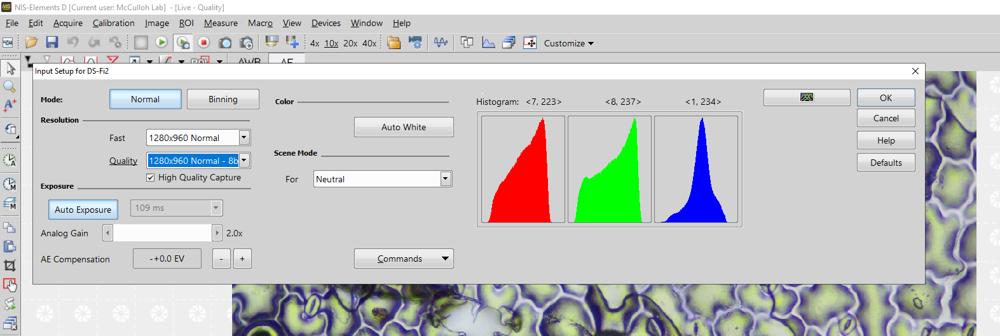
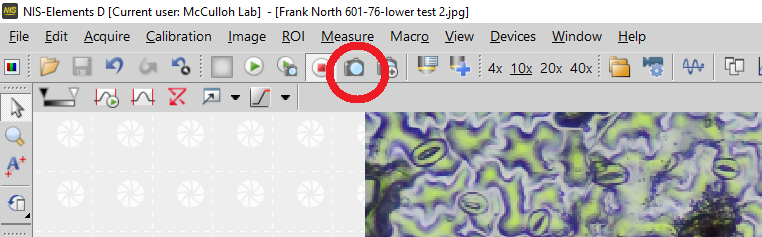

```{r setup, include=FALSE}
knitr::opts_chunk$set(echo = TRUE)
```


### 1. Prepare

1.1 Find a mold folder and take out one working page.  

1.2 Open the data sheet and find the number of the page. 

For north garden:
https://docs.google.com/spreadsheets/d/1xihtO0SSQLMLCAdFZAFwq3XT1wGSoP9B/edit?usp=sharing&ouid=102207485550371806190&rtpof=true&sd=true

For south garden:
https://docs.google.com/spreadsheets/d/1l0IMaZir0SRKR14aO3ckYuN5QF2ONtCX/edit?usp=drive_link&ouid=102207485550371806190&rtpof=true&sd=true


1.3 Take an unlabeled grid sheet and copy the sample IDs and any notes (most sheets will not have notes) from the labeled grid sheet to the unlabeled grid sheet.

1.4 Move all samples from the labeled grid sheet to the preparation area in the metal pallet in the same order. 

1.5 Check that the sample is clean and clean with paper towels if needed. 

### 2.Nail Polish 

2.1 Open a bottle of nail polish and make sure the brush is clean.

2.2 Apply an even coat of nail polish to each mold and put them back to the working place (full cove the mold, and as thin as possible). 

2.3 Wait for drying, about 10 minutes. 

2.4 Apply the dried nail polish with transparent tape and remove it from the mold.

2.5 Apply tape and nail polish to the slide, make it as flat as possible.


### 3. Use a microscope to take stomatal images.  

3.1. Computer and microscope 

  3.1.1 If the microscope has a cover, remove it carefully. 

  3.1.2 Open the light of the microscope.  

  3.1.3 Open the console power. 

  3.1.4 Turn the objective lens to 10X. 

  3.1.5 The computer should be in sleep mode, If the screen is black, check if the monitor is on.
  
  3.1.6 Open the NIS-Elements soft work on the computer.  

3.2. Observation and Imaging 

  3.2.1 Place the prepared slide on the observation stage 

  3.2.2 Open live observation (Green arrow button) 
  
  If this button not work, try live Quality (The button just on the right also with a green arrow)


  3.2.3 Before the first time use. Make sure the objective lens magnification is match (Click once 10X)
  
 
  
  
  3.2.4 Open the AE control if not (Auto light control) 



  3.2.5 Adjust focus and position to find the right, clear image
      
  * Easy to see the stomata 
  * The image should be bright, clear, and accurate focus 
  * Not a lot of bubbles or trichomes 
  
  3.2.6 Set resolution to $1280 \times 960$
 	    
 	* Go to the Acquire/Camera Setting/Quality menu
 	    



3.3 Use capture button take photo



 
  3.3.1 Use file label save image to the computer desktop 

  3.3.2 The file format is JEPG 
 
(CMD: should I use tif format?)

  3.3.3 Name the file

  * `YYYY_region_row_col_surface` (if doing a single image per mold)
  * `YYYY_region_row_col_surface_rep` (if doing a multiple images per mold)
  * Use `_`, no whitespace 
  * Always use lowercase 
  * `col` – always use three digits 

  Examples: 

  * 2023_north_101_001_upper 
  * 2023_north_101_001_upper_1 

### 4. Upload files and clean up  

  4.1 Upload the all images to the folder. 

  For quantity test:
https://drive.google.com/drive/folders/1rGSGvlBm00Ye6gKyBNPd3TnKy1ifnGRN?usp=drive_link
  
  For other data:

  North 2023: https://drive.google.com/drive/folders/1Y4d_mS67HFyicTvW2c8bdpv8SuKld3cf?usp=drive_link

  South 2023: https://drive.google.com/drive/folders/1iYK1C87dMIz8_xLXEpZffssG0rSQFYPU?usp=drive_link

  4.2 Report the image information on the data file, include taking date, rep number and name/name abbreviation. 
  
  Examples: 
  
  *001_01_Frank
  
  
  4.3 Place the completed molds on the new gridded sheet (with IDs and notes), secure them with tape again, and put it back to the folder. 

  4.4 Remove the tape and clean the slide with ethanol for next time. 

  4.5 Used tape can be thrown directly into the trash can 

  4.6 When done for the day, put all slides back to the box 

  4.7 Close the computer console, turn off the microscope light, and put the cover back 

 
### Precautions 

If the microscope is not used for a long time, turn off the power 

Don't disturb other people's work. 


 

