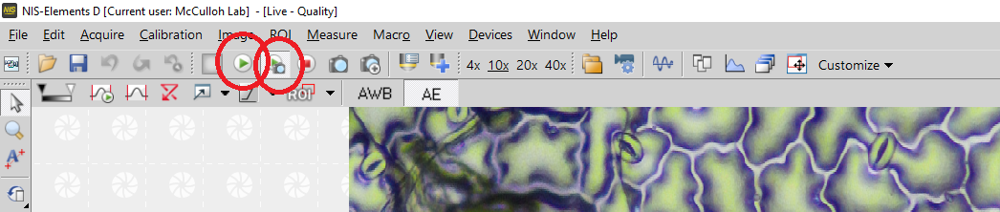
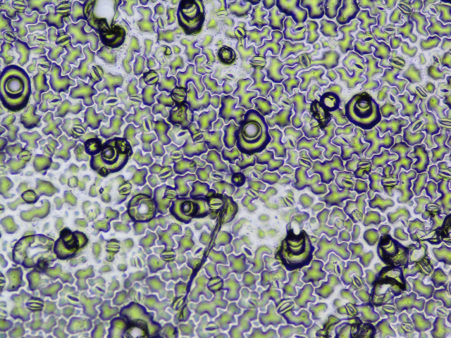

```{r setup, include=FALSE}
knitr::opts_chunk$set(echo = TRUE)
```

### 0. Read the assigned project description

### 1. Prepare

1.1 Find a mold folder and take out one working page.Need to determine if there is two finish working color markers. If only one, need to finish it priority. 

1.2 Open the data sheet and find the number of the page. 

You can find the information of the project description. 

1.3 Take an unlabeled grid sheet and copy the sample IDs and any notes (most sheets will not have notes) from the labeled grid sheet to the unlabeled grid sheet.

1.4 Put the tray on the table, the label should be on the upper left corner. 

1.5 Move the samples from the labeled grid sheet to the preparation area in the metal pallet in the same order. Only move one sample at each time, and put them facing up. 

1.6 Check that the sample is clean and clean with paper towels if needed. If needed, can use ethanol to clean the surface, but need to use the tissue to dry it before the next step.

1.7 Add the number ID on the data sheet
  * `YYYY_region_row_col_surface` (if doing a single image per mold)
  * `YYYY_region_row_col_surface_rep` (if doing a multiple images per mold)
  * Use `_`, no whitespace 
  * Always use lowercase 
  * `col` – always use three digits 

  Examples: 

  * 2023_north_101_001_upper 
  * 2023_north_101_001_upper_1 

### 2.Nail Polish 

2.1 Open a bottle of nail polish and make sure the brush is clean.
Make sure close it if don't use it.

2.2 Apply an even coat of nail polish to each mold and put them back to the working place (full cove the mold, and as thin as possible). 

Close the nail polish cover when finish used. 

2.3 Wait for drying, about 10 minutes. 

2.4 Apply the dried nail polish with transparent tape and remove it from the mold (The tape could be a little longer than tape. Fold the bottom end, so it will be easy to remove it later.)

2.5 Apply tape and nail polish to the slide, make it as flat as possible. Use a black marker to carefully record the sample number on the tape. Example:

  * 001_001_up
  * 001_001_low

### 3. Use a microscope to take stomatal images.  

3.1. Computer and microscope 

  3.1.1 If the microscope has a cover, remove it carefully. 

  3.1.2 Open the light of the microscope (check the light cover is full open) 
  
  3.1.3 Move the side lever to the middle position
  


  3.1.4 Open the console power. 

  3.1.5 Turn the objective lens to 10X. 

  3.1.6 The computer should be in sleep mode, If the screen is black, check if the monitor is on. 
  
  3.1.7 Illumination 
 
  * open the field diaphragm enough to illuminate the sample and bring the sample into focus.
   
  * Close the field diaphragm all the way and adjust the condenser focus to get a sharp edge
   
  * Open the field diaphragm until it almost fills the field of view. 
   
  * If not centered, adjust with the silver centering knobs. Each knob pulls the focus towards itself when tightened.
   
  * Open the field diaphragm just enought to fill the field of view leads to light scatter and hazy images.  
  
  3.1.8 Open the NIS-Elements soft work on the computer.  

3.2. Observation and Imaging 

  3.2.1 Place the prepared slide on the observation stage 

  3.2.2 Use the live Quality (The button on the right with a green arrow and camera). If this button not work, try live observation (The left one.)


  3.2.3 Before the first time use. Make sure the objective lens magnification is match (Click once 10X) (If forget this, it may not affect the picture quality, but it will affect the background information.)
  
 
  
  
  3.2.4 Open the AE control if not (Auto light control) 


  3.2.5 Adjust focus and position to find the right, clear image
      
  * Easy to see the stomata 
  * The image should be bright, clear, and accurate focus 
  * Not a lot of bubbles or trichomes 
  
  3.2.6 Set resolution to $1280 \times 960$ (check this when app close)
 	    
 	* Go to the Acquire/Camera Setting/Quality menu
 	    

You need to change both of two. The right size of the image will be around 3.6 MB.

3.3 Use capture button take photo


 
  3.3.1 Use file label save image to the computer/desktop/Muir lab 

  3.3.2 The file format is .tif 

  3.3.3 Name the file

  * `YYYY_region_row_col_surface` (if doing a single image per mold)
  * `YYYY_region_row_col_surface_rep` (if doing a multiple images per mold)
  * Use `_`, no whitespace 
  * Always use lowercase 
  * `col` – always use three digits 

  Examples: 

  * 2023_north_101_001_upper 
  * 2023_north_101_001_upper_1 

### 4. Upload files and clean up  

  4.1 Upload the all images to the folder (Checking the photo size when upload it. 1280 should be 3.5-4MB) 

You can find the information of the project description. 

  4.2 Report the image information on the data file, include the individuals number and, name abbreviation, and note if neeed. 

  Examples: 
  
  *2023_north_101_001_upper_1
  
  You can find the information of the project description. 
  
  
  4.3 Place the completed molds on the new gridded sheet (with IDs and notes), secure them with tape again, and put it back to the folder. 

  4.4 When finish one page, need to make the marker on the top. Use yellow highlighters for the front and red highlighters for the back side. 
 

  4.5 Remove the tape and clean the slide with ethanol for next time. 
  
  4.6 Used tape can be thrown directly into the trash can 

  4.7 When done for the day, put all slides back to the box 

  4.8 Close the computer console, turn off the microscope light, move the side lever to back, and put the cover back.

 
### Precautions 

If the microscope is not used for a long time, turn off the power 

Don't disturb other people's work. 

### Some bad exmaple

1. This nail polish is too thin and unequal




2. The light cover is not full open.


 

